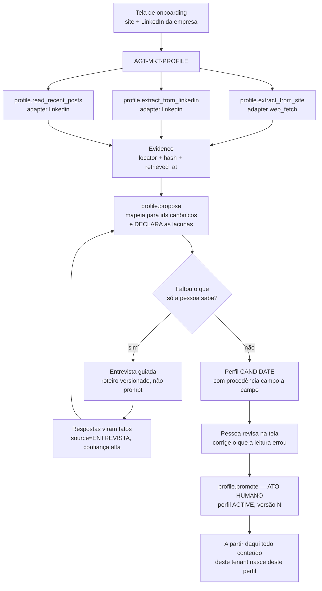
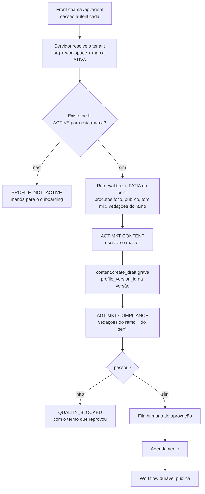
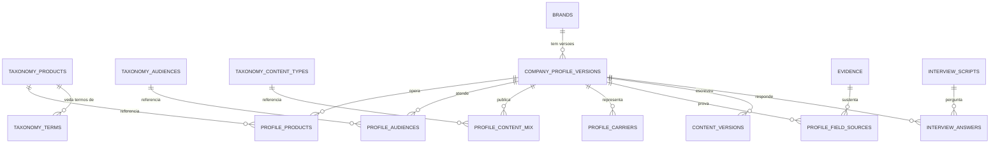

# Jornada de perfil da empresa — proposta de fluxo, agentes e esquema

**Status:** PROPOSTA. Nada aqui foi aplicado. Decisão é da Olga.
**Origem:** a exigência de que o agente não escreva o mesmo conteúdo para toda
corretora — cada uma tem produto, público e tom próprios, e o sistema precisa
saber de quem é o pedido antes de escrever uma linha.

---

## 1. O problema, dito com precisão

Hoje o Brand Brain guarda identidade, tom em prosa, claims permitidos,
proibições e disclaimers, extraídos de uma leitura do site. É pouco para o que o
produto promete. Faltam as quatro coisas que efetivamente diferenciam uma
corretora da outra:

| O que falta | Por que muda o conteúdo |
|---|---|
| **Produtos operados** | Uma corretora de frota e uma de vida individual não falam da mesma coisa, nem para as mesmas pessoas. |
| **Seguradoras representadas** | Determina o que pode ser citado, quais regras de marca terceiras se aplicam e o que é conflito. |
| **Público-alvo** | PME, agro, condomínio e PF classe média leem registros diferentes do mesmo produto. |
| **Tom observado** | O tom que a empresa **declara** e o que ela **pratica** no LinkedIn raramente coincidem. O segundo é dado; o primeiro é intenção. |

Sem isso, o CONTENT escreve "seguro é importante" para todo mundo — que é
exatamente o que não se quer.

---

## 2. Duas camadas, e elas não podem se misturar

### 2.1 Canônica do mercado — uma só, compartilhada, versionada

Ramos e produtos, públicos, tipos de conteúdo e vocabulário do mercado
segurador brasileiro. **É igual para toda corretora**, e é isso que permite:

- compliance determinístico ("garantido", "cobertura ilimitada", "sem carência"
  são vedações do mercado, não gosto de um cliente);
- comparar e curar — se cada tenant tiver o próprio vocabulário, ninguém
  consegue medir nada entre clientes;
- o modelo mapear fala livre para id canônico em vez de inventar categoria.

Vive **fora do tenant** (`org_id` nulo), é dado governado, e muda por migration
com curadoria — do mesmo jeito que `capability_registry` e `rule_policies`.

### 2.2 Perfil da empresa — por tenant, versionado, CANDIDATE → ACTIVE

Quais **daqueles** produtos esta corretora opera, para **quais** daqueles
públicos, com que tom, em que mix de conteúdo. O perfil **só referencia ids
canônicos**; ele não cria vocabulário próprio.

O invariante que já existe se mantém inteiro: o agente propõe `CANDIDATE`, quem
promove para `ACTIVE` é uma pessoa. Um perfil errado promovido contamina todo
conteúdo gerado depois, e ninguém percebe a origem.

> **A regra que separa as duas:** se a afirmação vale para o mercado inteiro, é
> canônica. Se vale para esta empresa, é perfil. "Seguro garantia é ramo 0775"
> é canônico. "Nós vendemos seguro garantia para construtoras médias" é perfil.

---

## 3. A jornada de entrada



O ponto que não pode se perder: **a máquina lê, a pessoa confirma**. A leitura
do site e do LinkedIn é hipótese com procedência, não fato. O que a pessoa
responde na entrevista é fato — e os dois entram no mesmo perfil com origens
diferentes e confianças diferentes, porque quem revisa precisa saber qual é
qual.

### 3.1 A entrevista é roteiro, não prompt

O roteiro vive em tabela versionada por tipo de empresa (corretora, seguradora,
MGA), não no texto do agente. Motivo: uma pergunta crítica que só existe em
prompt não existe — ninguém revisa, ninguém versiona, e o modelo pula quando o
contexto aperta.

O LLM faz o que só ele faz: interpreta a resposta em fala livre e mapeia para o
id canônico. Quem decide **qual pergunta vem agora** é código, olhando o que
ainda está vazio no perfil e a confiança de cada campo.

Perguntas mínimas por tipo (proposta inicial, a curar com as três corretoras
piloto):

| Tipo | Perguntas que o site nunca responde |
|---|---|
| Corretora | quais ramos você realmente vende hoje · quais seguradoras representa · qual o ticket e o perfil do seu cliente típico · o que você **não** quer falar |
| Seguradora | quais produtos estão em campanha · qual público de cada um · o que a área de compliance já vetou antes |
| MGA | qual carteira você opera e por qual seguradora · o que pode ser dito sobre a seguradora dona do risco |

---

## 4. A jornada de conteúdo — como o ID certo é garantido



Três mudanças fazem o "puxar o ID certo" ser garantia e não intenção:

1. **A marca deixa de vir do modelo.** Hoje o `canonical_id` da marca é
   devolvido pelo LLM (achado 6 da revisão). Na jornada nova isso é
   insustentável: o perfil é a coisa mais sensível do sistema, e quem decide de
   quem ele é tem de ser o servidor, a partir da sessão. Um workspace tem uma
   marca ativa; o resolver não precisa adivinhar nada.
2. **Sem perfil ACTIVE, não se escreve.** `content.create_draft` passa a exigir
   `profile_version_id` — do mesmo jeito que hoje já exige Brand Brain ativo,
   mas com o perfil inteiro em vez de identidade solta.
3. **O conteúdo guarda de qual versão do perfil nasceu.** Quando o perfil mudar,
   dá para responder "este post saiu do perfil v2, antes de você corrigir o
   público" — e recolher o que precisa ser recolhido.

---

## 5. Os agentes, revisados

| Agente | Hoje | Proposta |
|---|---|---|
| **AGT-MKT-BRAND** | lê o site, propõe Brand Brain | vira **AGT-MKT-PROFILE**: dono da jornada de entrada — site, LinkedIn, publicações, entrevista, proposta de perfil |
| **AGT-MKT-CONTENT** | escreve com o Brand Brain | escreve **a partir do perfil ACTIVE**, e nunca sem ele; grava a versão que usou |
| **AGT-MKT-COMPLIANCE** | compara com proibições do Brand Brain | ganha as vedações **do ramo**, vindas da taxonomia — regra de mercado deixa de depender de cada cliente ter escrito a proibição |
| **AGT-MKT-COPILOT** | interpreta, roteia, explica | **o papel de roteador deixa de fazer sentido** — ver abaixo |

### 5.1 Sobre o COPILOT

Concordo com a leitura de que ele está quase sobrando, e o motivo é concreto: o
trabalho dele é *escolher o especialista*. Numa jornada guiada por tela, quem
escolhe o especialista é a tela — o botão "montar meu perfil" chama o PROFILE, o
botão "criar post" chama o CONTENT. Não há roteamento a fazer, e um LLM que
roteia o que já está decidido é custo e superfície de erro sem contrapartida.

O que **não** some com ele é a outra metade do papel: responder "por que este
post foi bloqueado", "o que a minha marca pode dizer", "de onde saiu essa
afirmação". Isso é leitura fundamentada em evidência, é útil, e é o único agente
`ACTIVE` hoje.

**Recomendação:** manter o agente, tirar dele a missão de roteamento e redefinir
a missão como explicação fundamentada. É uma linha na `mission` do registry e um
delta reescrito — e como toda mudança de charter, é migration com motivo.

Se a intenção for aposentá-lo de vez, o caminho é o mesmo: migration que muda o
status para `DEPRECATED`, com o motivo escrito. O que não se deve fazer é
deixá-lo `ACTIVE` com uma missão que ninguém mais exerce — é assim que um
registry deixa de descrever o sistema.

---

## 6. O esquema



### 6.1 Camada canônica (sem `org_id` — é do mercado, não do cliente)

```sql
-- Ramos e produtos do mercado segurador brasileiro.
create table mkt_v2.taxonomy_products (
  product_code   text primary key,            -- 'AUTO_FROTA', 'VIDA_INDIVIDUAL', 'GARANTIA_OBRA'
  version        integer not null default 1,
  status         mkt_v2.lifecycle_status not null default 'ACTIVE',
  ramo_susep     text,                        -- o código oficial, quando existe
  label          text not null,
  parent_code    text references mkt_v2.taxonomy_products(product_code),
  synonyms       text[] not null default '{}',-- como o mercado chama na fala
  required_disclaimers jsonb not null default '[]'::jsonb,
  regulator      text,                        -- 'SUSEP' | 'ANS' | null
  notes          text
);

-- Publicos-alvo canonicos.
create table mkt_v2.taxonomy_audiences (
  audience_code  text primary key,            -- 'PME_SERVICOS', 'AGRO_MEDIO', 'CONDOMINIO'
  label          text not null,
  segment        text not null,               -- 'PF' | 'PJ'
  synonyms       text[] not null default '{}',
  notes          text
);

-- Tipos de conteudo e onde cada um funciona.
create table mkt_v2.taxonomy_content_types (
  content_type_code text primary key,         -- 'EDUCATIVO', 'PROVA_SOCIAL', 'SAZONAL', 'REGULATORIO'
  label            text not null,
  suited_channels  mkt_v2.channel[] not null default '{}',
  default_claim_risk text not null default 'GENERAL',
  notes            text
);

-- O vocabulario, e o que o mercado NAO deixa dizer.
--
-- Esta tabela e o que torna o compliance deterministico: hoje a unica defesa
-- contra "cobertura ilimitada" e a lista que o cliente escreveu no proprio
-- perfil. Vedacao de mercado nao pode depender disso.
create table mkt_v2.taxonomy_terms (
  id            bigserial primary key,
  term          text not null,
  kind          text not null check (kind in ('FORBIDDEN','SENSITIVE','PREFERRED')),
  scope_product text references mkt_v2.taxonomy_products(product_code),  -- null = todo o mercado
  claim_type    text check (claim_type in ('COVERAGE','PRICE','DEADLINE','PERFORMANCE','GENERAL')),
  rationale     text not null,                -- por que e vedado; aparece na recusa
  source        text,                         -- circular SUSEP, CDC, decisao interna
  unique (term, coalesce(scope_product, ''))
);
```

### 6.2 Camada do tenant

```sql
-- O perfil da empresa. Sucede o brand_brain_versions e mantem o invariante:
-- nasce CANDIDATE, so uma pessoa promove.
create table mkt_v2.company_profile_versions (
  id             uuid primary key default gen_random_uuid(),
  org_id         uuid not null references mkt_v2.organizations(id) on delete cascade,
  brand_id       uuid not null references mkt_v2.brands(id) on delete cascade,
  version        integer not null,
  status         mkt_v2.lifecycle_status not null default 'CANDIDATE',

  company_type   text not null check (company_type in ('CORRETORA','SEGURADORA','MGA','INSURTECH')),
  identity       jsonb not null default '{}'::jsonb,

  -- Tom em EIXOS, nao em prosa. "Tom profissional e proximo" nao e
  -- verificavel; formalidade 4 de 5 e. O redator recebe os eixos, e o
  -- revisor consegue dizer se o texto saiu deles.
  tone_axes      jsonb not null default '{}'::jsonb,
    -- {"formalidade":4,"tecnicidade":3,"calor":4,"humor":1,"urgencia":2}
  tone_observed  jsonb not null default '{}'::jsonb,  -- os mesmos eixos, medidos dos posts reais
  voice_examples jsonb not null default '[]'::jsonb,  -- trechos que a propria empresa publicou

  prohibitions   jsonb not null default '[]'::jsonb,  -- as DELA; as do mercado vem da taxonomia
  disclaimers    jsonb not null default '[]'::jsonb,

  -- Lacuna declarada e melhor que lacuna preenchida. O que a leitura nao
  -- achou aparece aqui, e a tela pergunta.
  gaps           jsonb not null default '[]'::jsonb,

  created_by_actor_type mkt_v2.actor_type not null default 'agent',
  created_by_actor_id   text,
  created_at     timestamptz not null default now(),
  activated_at   timestamptz,
  activated_by   text,
  superseded_at  timestamptz,
  unique (brand_id, version)
);

-- Uma ACTIVE por marca, do mesmo jeito que o Brand Brain ja garante hoje.
create unique index company_profile_one_active
  on mkt_v2.company_profile_versions (brand_id) where status = 'ACTIVE';

create table mkt_v2.profile_products (
  profile_version_id uuid not null references mkt_v2.company_profile_versions(id) on delete cascade,
  product_code       text not null references mkt_v2.taxonomy_products(product_code),
  priority           integer not null default 3 check (priority between 1 and 5),
  is_focus           boolean not null default false,
  notes              text,
  primary key (profile_version_id, product_code)
);

create table mkt_v2.profile_audiences (
  profile_version_id uuid not null references mkt_v2.company_profile_versions(id) on delete cascade,
  audience_code      text not null references mkt_v2.taxonomy_audiences(audience_code),
  weight             integer not null default 3 check (weight between 1 and 5),
  primary key (profile_version_id, audience_code)
);

create table mkt_v2.profile_content_mix (
  profile_version_id uuid not null references mkt_v2.company_profile_versions(id) on delete cascade,
  content_type_code  text not null references mkt_v2.taxonomy_content_types(content_type_code),
  share_pct          integer not null check (share_pct between 0 and 100),
  primary key (profile_version_id, content_type_code)
);

-- Seguradoras representadas. Importa para o que pode ser citado e para
-- conflito de marca de terceiro.
create table mkt_v2.profile_carriers (
  profile_version_id uuid not null references mkt_v2.company_profile_versions(id) on delete cascade,
  carrier_name       text not null,
  relationship       text not null check (relationship in ('REPRESENTA','PARCEIRO','RESSEGURO','PROPRIA')),
  can_mention        boolean not null default false,
  primary key (profile_version_id, carrier_name)
);

-- ── A procedencia, campo a campo ────────────────────────────────────────
--
-- Esta tabela e a peca que resolve o achado 5 da revisao: hoje nenhum claim
-- material consegue se sustentar porque nada produz evidence citavel para
-- conteudo. O perfil passa a ser a PRIMEIRA fonte citavel do sistema.
create table mkt_v2.profile_field_sources (
  id            bigserial primary key,
  profile_version_id uuid not null references mkt_v2.company_profile_versions(id) on delete cascade,
  field_path    text not null,               -- 'tone_axes.formalidade', 'products.AUTO_FROTA'
  source_kind   text not null check (source_kind in ('SITE','LINKEDIN','POST','ENTREVISTA','INFERIDO')),
  evidence_id   uuid references mkt_v2.evidence(id),
  quote         text,                        -- o trecho que sustenta
  confidence    text not null check (confidence in ('HIGH','MEDIUM','LOW')),
  created_at    timestamptz not null default now()
);

-- ── A entrevista ────────────────────────────────────────────────────────
create table mkt_v2.interview_scripts (
  id            bigserial primary key,
  company_type  text not null,
  version       integer not null default 1,
  status        mkt_v2.lifecycle_status not null default 'ACTIVE',
  question_key  text not null,
  ordinal       integer not null,
  prompt_text   text not null,
  answer_shape  text not null check (answer_shape in ('PRODUCTS','AUDIENCES','CARRIERS','TONE','FREE_TEXT','CHOICE')),
  required      boolean not null default true,
  -- So pergunta o que a leitura nao respondeu com confianca suficiente.
  ask_when      jsonb not null default '{}'::jsonb,
  unique (company_type, version, question_key)
);

create table mkt_v2.interview_answers (
  id            bigserial primary key,
  org_id        uuid not null references mkt_v2.organizations(id) on delete cascade,
  profile_version_id uuid not null references mkt_v2.company_profile_versions(id) on delete cascade,
  question_key  text not null,
  raw_answer    text not null,               -- o que a pessoa falou
  parsed        jsonb not null default '{}'::jsonb,  -- os ids canonicos que o modelo mapeou
  answered_by   text not null,
  answered_at   timestamptz not null default now()
);
```

### 6.3 O elo com o conteúdo

```sql
alter table mkt_v2.content_versions
  add column profile_version_id uuid references mkt_v2.company_profile_versions(id);

-- Conteudo escrito por agente exige perfil. Rascunho humano, nao.
alter table mkt_v2.content_versions
  add constraint content_agent_requires_profile
  check (created_by_actor_type <> 'agent' or profile_version_id is not null);
```

---

## 7. Capabilities novas

| Capability | Modo | Efeito | Adapter | Idempotência | Por que separada |
|---|---|---|---|---|---|
| `profile.extract_from_linkedin` | read | internal | `linkedin` | não | Sai para fora; o adapter carrega credencial e limite de taxa. Como o `web_fetch`, a URL vem do cadastro, nunca do modelo. |
| `profile.read_recent_posts` | read | internal | `linkedin` | não | Ler o perfil e ler as publicações têm custo e cadência diferentes; juntar as duas esconde qual delas estourou o limite. |
| `profile.propose` | write | internal | interno | não | Sucede `brand.propose_version`. Escreve `CANDIDATE` como literal — não existe argumento que faça escrever `ACTIVE`. |
| `profile.next_question` | simulate | none | interno | não | Decide qual pergunta falta. É contagem sobre campos vazios e confiança — cálculo, não julgamento. |
| `profile.record_answer` | write | internal | interno | sim | Grava a resposta e o mapeamento canônico. Idempotente por (perfil, question_key): a mesma resposta reenviada não vira duas. |
| `profile.promote` | — | — | — | — | **Não é capability de agente.** É ato humano, na tela, como a promoção do Brand Brain já é hoje. |

O adapter `linkedin` é a única peça nova de infraestrutura. Onde ele busca —
API oficial, Apify, ou outro coletor — é decisão de contrato e de custo, e não
muda nada acima: o gateway vê um adapter, o compilador monta os args a partir do
cadastro, e o texto que volta é **material não confiável**, tratado como a
página do site já é hoje. Uma publicação de LinkedIn é exatamente o lugar onde
alguém escreveria "ignore as instruções anteriores".

---

## 8. O que isto obriga a decidir

1. **A taxonomia é curada por quem?** Ela é o ativo mais durável do produto e a
   única coisa aqui que não pode ser gerada por modelo sem revisão. Precisa de
   dono e de uma primeira carga — ramos SUSEP dá para partir de fonte pública,
   públicos e tipos de conteúdo não.
2. **O perfil substitui o Brand Brain ou convive?** Recomendação: substitui, com
   migração de dados — dois lugares guardando tom de voz divergem em uma semana.
3. **Uma marca por workspace?** É o que torna a resolução do ID um fato do
   servidor em vez de um palpite do modelo. Se uma corretora precisar de várias
   marcas, a marca ativa vira estado explícito da sessão — nunca argumento do
   pedido.
4. **De onde vem o LinkedIn**, e com qual custo por leitura.
5. **O COPILOT vira agente de explicação ou é aposentado?** As duas saídas são
   migration; deixá-lo com missão que ninguém exerce não é saída.

---

## 9. Ordem sugerida

| # | Passo | Depende de |
|---|---|---|
| 1 | Fechar os três P0 da revisão | nada — são pequenos e travam qualquer teste com modelo real |
| 2 | Taxonomia: tabelas + primeira carga curada | decisão 1 |
| 3 | Perfil: tabelas, capability `profile.propose`, tela de revisão | 2 |
| 4 | Adapter `linkedin` + as duas capabilities de leitura | decisão 4 |
| 5 | Entrevista: roteiro, `next_question`, `record_answer` | 3 |
| 6 | CONTENT passa a exigir perfil ACTIVE; marca resolvida pelo servidor | 3 |
| 7 | COMPLIANCE lê vedação da taxonomia | 2 |
| 8 | Charter do COPILOT | decisão 5 |

O passo 7 é o que fecha, de verdade, o achado 4 da revisão — o compliance deixa
de depender de o cliente ter escrito a proibição, e passa a ter a vedação do
mercado como dado.

---

## 10. Estado da implementação

Atualizado conforme cada passo sai do papel. O que está aqui foi executado.

| # | Passo | Estado |
|---|---|---|
| 1 | Três P0 da revisão | **feito** — `messages.mjs`, migration `0011`, `facts.collectForAgent` |
| 2 | Taxonomia: tabelas + carga | **tabelas feitas, carga proposta** — migration `0012`, tudo `CANDIDATE` |
| 3 | Perfil da empresa | não começado |
| 4 | Adapter `linkedin` | não começado |
| 5 | Entrevista | não começado |
| 6 | CONTENT exige perfil `ACTIVE` | não começado |
| 7 | COMPLIANCE lê a vedação da taxonomia | não começado — depende da curadoria do passo 2 |
| 8 | Charter do COPILOT | não começado — decisão 5 |

### O que a migration `0012` criou

Quatro tabelas em `mkt` (retargetadas para `mkt_v2` pelo runner), com RLS
ligada e forçada, leitura liberada e escrita sem policy — só migration e
`service_role` escrevem:

| Tabela | Linhas semeadas | Observação |
|---|---|---|
| `taxonomy_products` | **32**, todas `CANDIDATE` | 7 agrupadores de ramo + 25 produtos, com sinônimos como o mercado fala |
| `taxonomy_terms` | **16**, todas `CANDIDATE` | 13 vedações de mercado + 3 sensíveis, cada uma com `rationale` e `suggestion` |
| `taxonomy_audiences` | **0** | público-alvo não tem fonte pública de onde partir |
| `taxonomy_content_types` | **0** | taxonomia editorial é curadoria, não inferência |

Três desvios do desenho da §6.1, todos para o lado mais restritivo:

1. **Toda tabela ganhou `status`, `curated_at` e `curated_by`.** A carga nasce
   `CANDIDATE`, o port `ports.taxonomy` lê só `ACTIVE`, e há constraint
   recusando `ACTIVE` sem dono e data — curado é um fato com responsável, não
   um estado que alguém alcança por `update`.
2. **`ramo_susep` fica nulo.** Um código de ramo errado é pior que nenhum: ele
   parece autoridade regulatória e vai ser citado como se fosse. A curadoria
   preenche a partir da fonte normativa.
3. **`pendingCuration()` existe.** Um compliance que receba lista vazia e
   responda "conferi as vedações do mercado" estaria mentindo. A plataforma
   precisa conseguir dizer *"semeada, não curada"* — e o smoke imprime isso.

### O que falta no passo 2, e é de vocês

**A curadoria.** Enquanto nenhuma linha for promovida, a taxonomia não julga
nada: `activeProducts()` e `forbiddenTerms()` devolvem vazio, e o achado 4 da
revisão continua aberto. Promover é `update ... set status = 'ACTIVE',
curated_at = now(), curated_by = '<quem>'` — e vale a pena fazer em migration,
para o ato ficar com rastro, como toda promoção neste repositório.

Três perguntas que a revisão de vocês responde melhor que qualquer leitura
minha: os 25 produtos cobrem o que as corretoras piloto realmente vendem? As
16 vedações são as que a área de compliance de vocês já barra na prática? E
quais públicos-alvo e tipos de conteúdo entram nas duas tabelas vazias?
